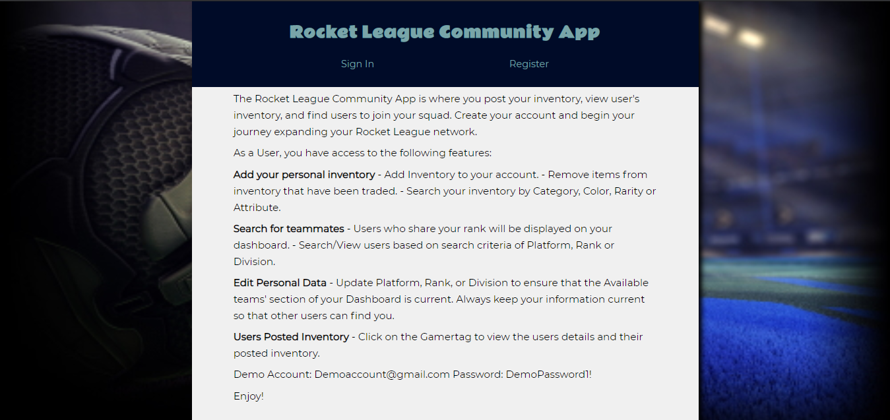
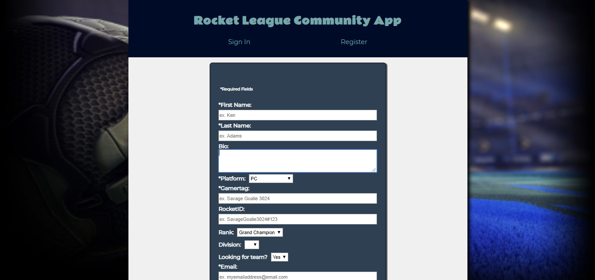
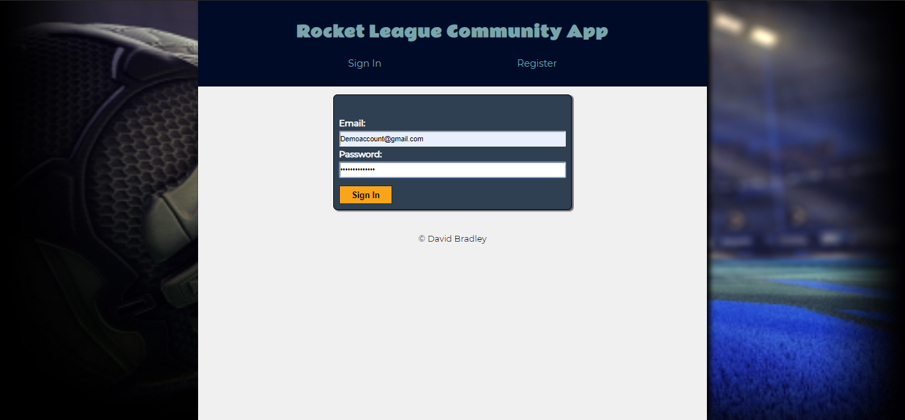
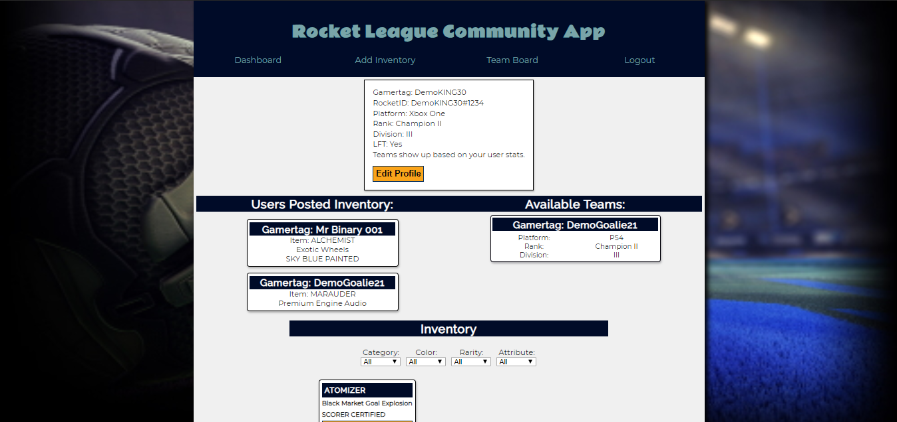
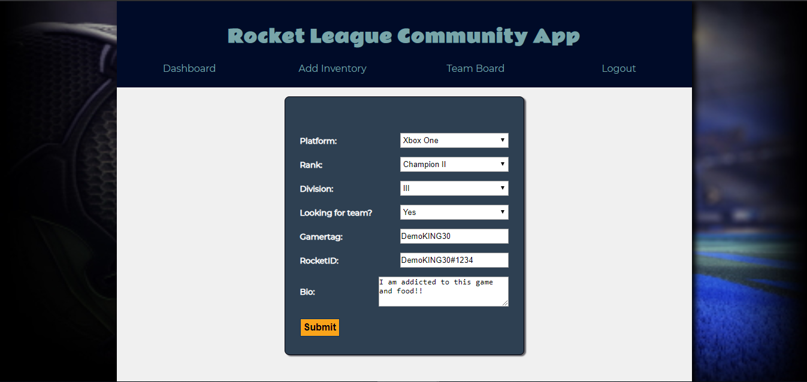
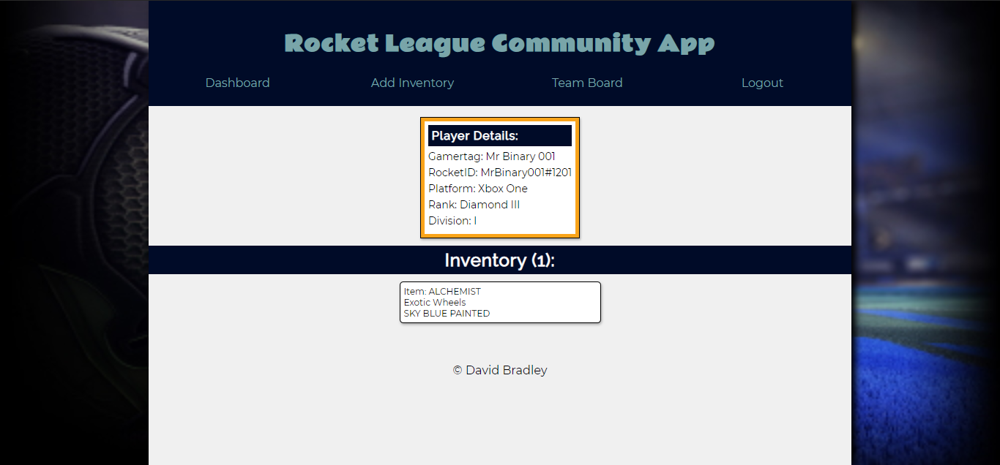
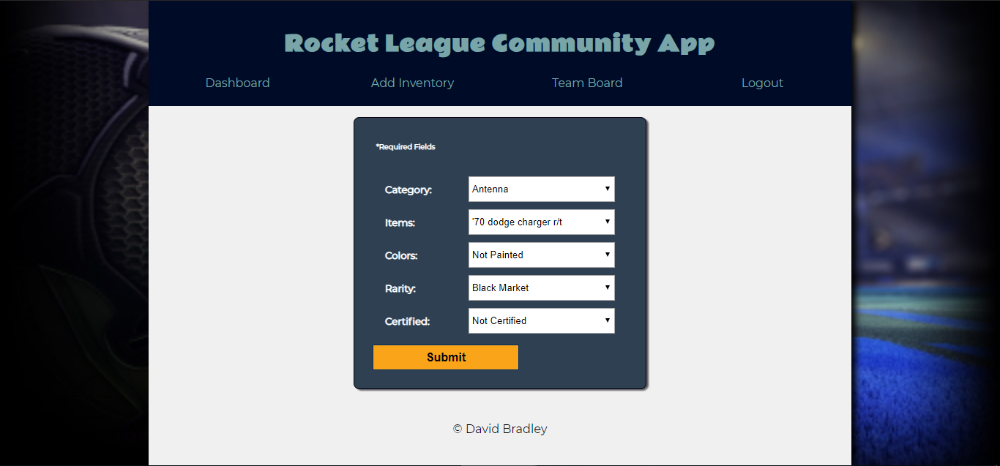
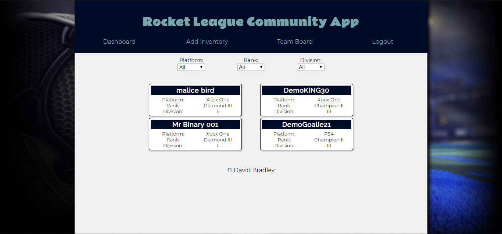

# Rocket Leage Community App

This app was dreamt up by a casual player with the hopes of making it easier to find team members and trade unwanted items.

Whether you're a casual player or obsessed with the game, you can find someone to play with on your platform. You can also take a moment to add unwanted inventory to your profile so that other users can view them.

## Features:
- Responsive & Accessible Design
- Register for an account
- Secure Signin
- User Dashboard
  - Edit User Details
  - View available inventory
  - View users seeking Team who share your rank
  - View specific users inventory and user details
- Add Inventory Items
- Search your Inventory by Category, Color, Rarity and/or Attribute

## Built with
### Front-End
* HTML5
* CSS3
* JavaScript/ES6
* ReactJS
* [RESTful API](https://github.com/djbradleyii/rl-trading-app-server)
### [Back-End](https://github.com/djbradleyii/rl-trading-app-server)
* NodeJS
* ExpressJS
* PostgreSQL

## Demo

- [Live Demo](https://rocket-league-community-app.now.sh/)

## Screenshots
Landing Page:

Register:  

Sign In:  

Dashboard:

Edit User Details:

User's Inventory:

Add Inventory Item:

Team Board:  

